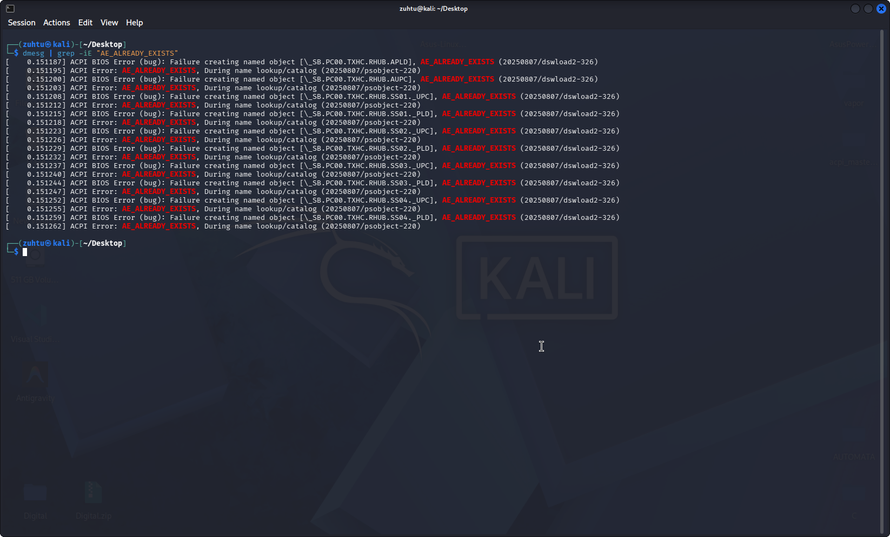
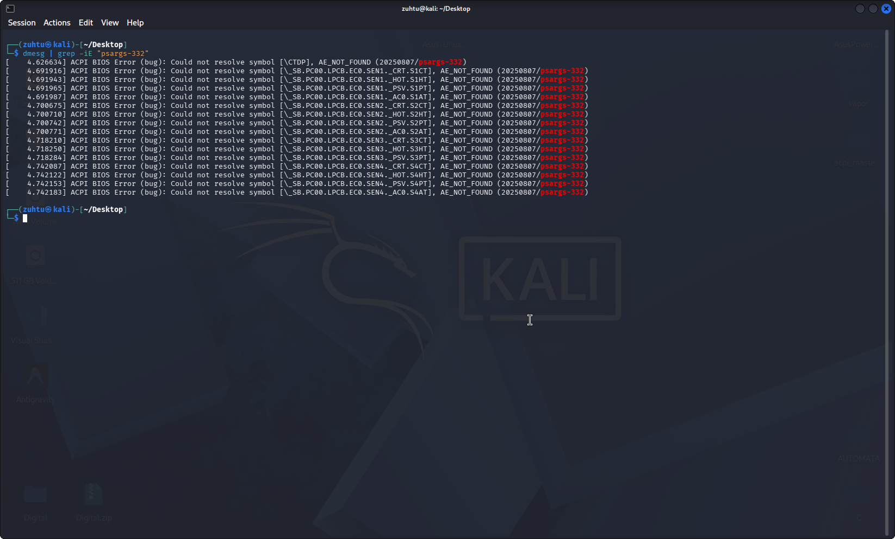

# 🛡️ Asus ACPI Table Overrides for Linux

[](https://opensource.org/licenses/MIT)
[](https://www.linux.org/)

This repository provides modular ACPI patches to resolve common hardware-level bugs on Asus laptops running Linux (Kali, Debian, Ubuntu, etc.). Specifically, it addresses the **Shutdown/Suspend hang** caused by USB-C (TXHC) namespace collisions and **Thermal Sensor** errors in dmesg.

---

## 🔍 Issues Addressed

### 1. USB-C / Thunderbolt Namespace Collision (TXHC)
* **Symptom:** System hangs or freezes at the logo screen during shutdown, restart, or suspend.
* **Root Cause:** A namespace collision (`AE_ALREADY_EXISTS`) where the BIOS attempts to redefine existing USB-C Root Hub methods.
* **Solution:** An override SSDT table with a higher revision (`0x3000`) that bypasses conflicting methods.

### 2. EC0 Thermal Sensor Missing Symbols (EC0T)
* **Symptom:** Flooded dmesg logs with `AE_NOT_FOUND` errors regarding thermal thresholds.
* **Root Cause:** Missing global thermal variables (`S1CT`, `S1HT`, etc.) required by the Embedded Controller (EC0).
* **Solution:** Injecting the missing thermal variables into the global namespace.

---

## 📸 Proof of Work

| Issue Type | Before Patch (Errors) | After Patch (Fixed) |
| :--- | :--- | :--- |
| **TXHC Fix** |  |  |
| **EC0 Fix** |  |  |

---

## 🛠️ Deployment Guide

### 📋 Prerequisites
You only need `cpio` installed to create the initrd image archive. (`iasl` is not required as the patches are pre-compiled in `bin/`):

```bash
sudo apt update && sudo apt install cpio
```

### 1. Project Setup
Clone the repository and enter the project root directory:
```bash
git clone https://github.com/zuhtuEren/asus-acpi-override.git
cd asus-acpi-override
```

### 2. Automated Installation
Navigate to the `scripts/` directory and run the installer:
```bash
cd scripts
chmod +x install.sh
./install.sh
```

**Note:** The script will prompt you to choose the patches and generate an `.img` file (e.g., `acpi_fixed.img`) in the project root.

### 3. Finalizing (GRUB)
Copy the generated image to `/boot`:
```bash
sudo cp ../acpi_fixed.img /boot/
```

Edit your GRUB configuration:
```bash
sudo nano /etc/default/grub
```
Add the following line (use the exact filename generated by the script):
`GRUB_EARLY_INITRD_LINUX_CUSTOM="acpi_fixed.img"`

Update GRUB and reboot the system:
```bash
sudo update-grub && sudo reboot
```

---

## 📂 System Architecture

The project maintains a clean structure for readability and ease of use:

```text
Asus-Linux-ACPI-Fix/
├── bin/                     # Compiled AML (.aml) files ready for injection
├── docs/                    # Technical logs and visual evidence of the fixes
├── scripts/                 # Automation tools for installation and cleanup
│   ├── install.sh           # Main installation script
│   └── uninstall.sh         # Cleanup script
└── src/                     # Human-readable ACPI Source Language (.dsl) files
```

---

## 🗑️ Uninstallation

To remove the patches and revert to stock BIOS behavior, ensure you are in the project's **root directory** and run:

```bash
cd scripts
sudo chmod +x uninstall.sh
sudo ./uninstall.sh
```

---

## ⚠️ Disclaimer
> **Warning:** Modifying ACPI tables is a low-level operation. While these patches are tested, they involve hardware-level overrides. Use at your own risk. Always keep a Live USB handy to revert changes if your system fails to boot.

---

## 👨‍💻 Author
**Zühtü Eren İncekara** - *Computer Engineering Student & Linux Enthusiast* - [GitHub](https://github.com/zuhtuEren)

## ⚖️ License
Distributed under the MIT License. See `LICENSE` for more information.
